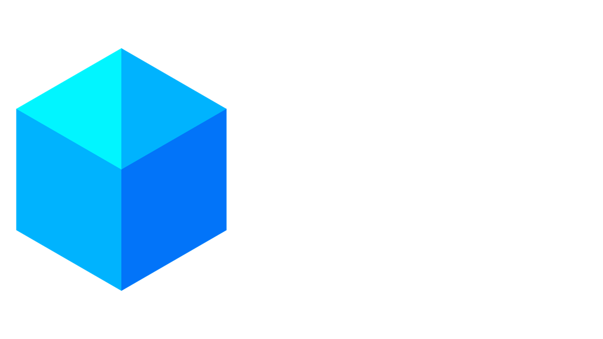

# Table of Contents
1. [Description](#description)
2. [How to join](#how-to-join)
3. [How It Works](#how-it-works)
4. [Credits](#credits)

## Description
This all started when chat reporting was added, I don't think many people liked it at all. New mods and plugins came out, removing/blocking chat reporting but there needs to be a system independent from Microsoft. That's where AltAuth comes in, it allows you to join Minecraft servers without contacting Microsoft servers (and no the servers don't need to be cracked).
## How to join

## How it works

## Credits
[Block icon in logo made by Flaticon.](https://www.flaticon.com/free-icons/block)
